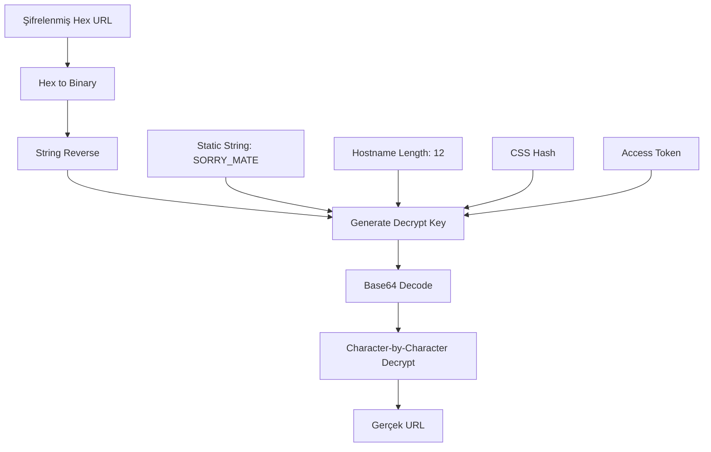

# 🔓 9xBuddy URL Decoder

**9xBuddy.site** sitesinden alınan şifrelenmiş URL'leri çözmek için geliştirilmiş reverse engineering projesi.


## 📋 İçindekiler

- [Genel Bakış](#genel-bakış)
- [Algoritma Detayları](#algoritma-detayları)
- [Reverse Engineering Süreci](#reverse-engineering-süreci)
- [Kurulum ve Kullanım](#kurulum-ve-kullanım)
- [API Referansı](#api-referansı)
- [Teknik Detaylar](#teknik-detaylar)
- [Güvenlik Notları](#güvenlik-notları)
- [Katkıda Bulunma](#katkıda-bulunma)

## 🎯 Genel Bakış

9xBuddy, YouTube ve diğer video platformlarından video/audio indirme hizmeti sunan bir sitedir. Ancak indirme linklerini şifrelenmiş hexadecimal format'ta sunmaktadır. Bu proje, bu şifreleme algoritmasını tersine mühendislik yöntemiyle çözerek gerçek indirme URL'lerini elde etmeyi sağlar.

### Desteklenen Formatlar
- 🎵 **Audio**: MP3, M4A
- 🎬 **Video**: MP4 (144p, 240p, 360p, 480p, 720p, 1080p)
- 🖼️ **Thumbnail**: JPG
- 📝 **Subtitle**: SRT
- 🎞️ **GIF**: Animasyonlu GIF

## 🔬 Algoritma Detayları

### Şifreleme Sistemi Analizi

9xBuddy'nin URL şifreleme sistemi multi-layer bir yaklaşım kullanır:

```
[Gerçek URL] → [Encrypt] → [Base64] → [Hex] → [Şifrelenmiş URL]
```

### Çözme Algoritması

#### 1. **Hex to Binary Dönüşümü**
```javascript
function hex2bin(hexString) {
    const result = [];
    for (let i = 0; i < hexString.length; i += 2) {
        const byte = parseInt(hexString.substr(i, 2), 16);
        result.push(String.fromCharCode(byte));
    }
    return result.join('');
}
```

#### 2. **String Reversal**
```javascript
const reversed = hexDecoded.split("").reverse().join("");
```

#### 3. **Decrypt Key Generation**
Şifre çözme anahtarı şu formülle oluşturulur:

```javascript
const decryptKey = STATIC_STRING + HOSTNAME_LENGTH + CSS_HASH + ACCESS_TOKEN;
```

**Bileşenler:**
- `STATIC_STRING`: `"SORRY_MATE"` (ASCII [69,84,65,77,95,89,82,82,79,83] reversed)
- `HOSTNAME_LENGTH`: `12` (9xbuddy.site karakter sayısı)
- `CSS_HASH`: CSS dosyasından regex ile çıkarılan hash
- `ACCESS_TOKEN`: API'den alınan access token

#### 4. **Custom Decrypt Algorithm**
```javascript
function decrypt(encryptedData, key) {
    let result = "";
    const decodedData = base64Decode(encryptedData);
    
    for (let i = 0; i < decodedData.length; i++) {
        const encChar = decodedData.substr(i, 1);
        const keyChar = key.substr(i % key.length - 1, 1);
        const decChar = String.fromCharCode(
            Math.floor(ord(encChar) - ord(keyChar))
        );
        result += decChar;
    }
    
    return result;
}
```

### Tam Algoritma Akışı



## 🕵️ Reverse Engineering Süreci

### 1. **API Endpoint Analizi**

İlk olarak 9xBuddy'nin API çağrılarını analiz ettim:

```bash
# Token alma
POST https://ab1.9xbud.com/token
Response: {"status": "1", "access_token": "aZiQ..."}

# URL çıkarma
POST https://ab1.9xbud.com/extract
Response: {"formats": [{"url": "3d4171326658..."}]}
```

### 2. **JavaScript Dosyası İncelemesi**

`422.cb67d183996514034d45.js` dosyasında kritik **U fonksiyonunu** keşfettim:

```javascript
var U = function(e, t) {
    var n = document.head.innerHTML,
        r = /\/build\/main\.([^"]+?).css/g.exec(n);
    
    if (!r) return "";
    
    var a = r[1],
        o = (new _.A).hex2bin(e).split("").reverse().join(""),
        s = [69,84,65,77,95,89,82,82,79,83].map(function(e) {
            return String.fromCharCode(e)
        }).join("").split("").reverse().join(""),
        i = "".concat(s).concat(document.location.hostname.length).concat(a).concat(t);
    
    return (new _.A).decrypt(o, i);
};
```

### 3. **Static String Keşfi**

ASCII array'ını decode ederek gizli string'i buldum:
```javascript
[69,84,65,77,95,89,82,82,79,83] 
→ "ETAM_YRROS" 
→ reverse → "SORRY_MATE"
```

### 4. **Decrypt Helper Class**

`585.cb67d183996514034d45.js` dosyasında decrypt fonksiyonlarını buldum:

```javascript
class DecryptHelper {
    decode64(e) { /* Custom Base64 decode */ }
    ord(e) { /* Character code */ }
    decrypt(e, t) { /* Main decrypt algorithm */ }
    hex2bin(e) { /* Hex to binary conversion */ }
}
```

### 5. **CSS Hash Extraction**

URL decrypt'i için CSS dosyasından hash çıkarma regex'i:
```javascript
/\/build\/main\.([^"]+?).css/g
```

## 🚀 Kurulum ve Kullanım

### Web Interface (Önerilen)

1. `index.html` dosyasını indirin
2. Tarayıcıda açın
3. Access token ve şifrelenmiş URL'i girin
4. "URL'i Çöz" butonuna tıklayın

### JavaScript Library

```html
<script src="buddy-decryptor.js"></script>
<script>
const decryptor = new BuddyDecryptor();
const decodedUrl = decryptor.decryptUrl(encryptedUrl, token);
console.log(decodedUrl);
</script>
```

### Node.js Usage

```javascript
const BuddyDecryptor = require('./buddy-decryptor');

const decryptor = new BuddyDecryptor();
const result = decryptor.decryptUrl(
    "3d41713266583672576571733971617170657068696e4a6c624e39316d4f7034774f3256637274755061397834794d32584850595137737a7a53706476796f68326457696e4f4b706f6d70636975717279744b704a725a70555064596c7171777642347a476a4c752b4b4962",
    "aZiQbmWWY2xhcXCeqaWko21jk22tk6aSlade1suqnKeZqqKmnmVmZGpeY2KUYmVRhI+Xj6LMkWtqm19raWlqZ2U="
);

console.log(result);
// Output: //offmp3.net/process?url=https%3A%2F%2Fwww.youtube.com%2Fwatch%3Fv%3Dx7HA9KJKniU
```

## 📚 API Referansı

### BuddyDecryptor Class

#### Constructor
```javascript
const decryptor = new BuddyDecryptor();
```

#### Methods

##### `decryptUrl(encryptedUrl, token, cssHash?)`
Şifrelenmiş URL'i çözer.

**Parameters:**
- `encryptedUrl` (string): Hexadecimal format'ta şifrelenmiş URL
- `token` (string): 9xBuddy API'den alınan access token
- `cssHash` (string, optional): CSS hash değeri (default: "cb67d183996514034d45")

**Returns:** `string` - Çözülmüş URL

**Example:**
```javascript
const url = decryptor.decryptUrl(
    "3d41713266583672...",
    "aZiQbmWWY2xhcXCe...",
    "cb67d183996514034d45"
);
```

##### `decryptAllUrls(formats, token, cssHash?)`
Format array'indeki tüm URL'leri çözer.

**Parameters:**
- `formats` (Array): Format objelerinin array'i
- `token` (string): Access token
- `cssHash` (string, optional): CSS hash

**Returns:** `Array` - Çözülmüş URL'ler ile genişletilmiş format array'i

## 🔧 Teknik Detaylar

### Bağımlılıklar
- Sıfır bağımlılık
- Vanilla JavaScript
- Modern ES6+ syntax


## 🛡️ Güvenlik Notları

⚠️ **Önemli Uyarılar:**

1. **Eğitim Amaçlı**: Bu proje reverse engineering eğitimi için oluşturulmuştur
2. **Yasal Sorumluluk**: Kullanıcılar yasal sorumluluklarını kendileri taşır
3. **Telif Hakları**: İndirilen içeriklerin telif hakları sahiplerine aittir
4. **Rate Limiting**: API isteklerinde rate limiting'e dikkat edin

## 📊 Test Verileri

### Örnek Encrypted URL
```
3d41713266583672576571733971617170657068696e4a6c624e39316d4f7034774f3256637274755061397834794d32584850595137737a7a53706476796f68326457696e4f4b706f6d70636975717279744b704a725a70555064596c7171777642347a476a4c752b4b4962
```

### Örnek Access Token
```
aZiQbmWWY2xhcXCeqaWko21jk22tk6aSlade1suqnKeZqqKmnmVmZGpeY2KUYmVRhI+Xj6LMkWtqm19raWlqZ2U=
```

### Beklenen Çıktı
```
//offmp3.net/process?url=https%3A%2F%2Fwww.youtube.com%2Fwatch%3Fv%3Dx7HA9KJKniU
```

## 🔍 Troubleshooting

### Sık Karşılaşılan Hatalar

#### "Hex decode hatası"
- **Sebep**: Geçersiz hex string
- **Çözüm**: URL'in doğru kopyalandığından emin olun

#### "Invalid access token"
- **Sebep**: Token süresi dolmuş
- **Çözüm**: Yeni token alın

#### "URL çözülemedi"
- **Sebep**: CSS hash yanlış
- **Çözüm**: Güncel CSS hash kullanın

### Debug Mode

```javascript
const decryptor = new BuddyDecryptor();
decryptor.debug = true; // Debug logları aktif
```


